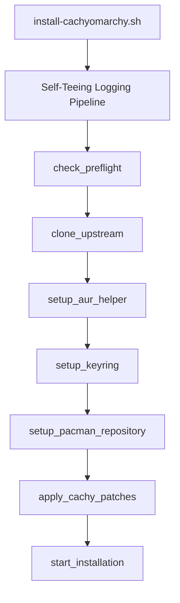

# 🚀 CachyOmarchy

[](https://cachyos.org)
[](#)
[](LICENSE)

An optimized, highly resilient, and modular installation pipeline to deploy **Basecamp's Omarchy Hyprland Desktop Environment** seamlessly on **CachyOS**.

> [!NOTE]
> **Project Origin & AI Optimization:** This repository is an advanced, modular, and hardened fork of the original [mroboff/omarchy-on-cachyos](https://github.com/mroboff/omarchy-on-cachyos) project. It has been **extensively optimized, refactored, and enhanced using advanced Agentic AI engineering (Antigravity)** to guarantee clean modular scripting, robust session-wide logging, and seamless hardware-level CachyOS kernel compatibility.

---

## 📖 Table of Contents
1. [Core Philosophy](#-core-philosophy)
2. [What This Script Does and Does Not Do](#-what-this-script-does-and-does-not-do)
3. [📋 Pre-Requisites](#-pre-requisites)
4. [⚠️ Important Notes (Key Architectural Decisions)](#%EF%B8%8F-important-notes-key-architectural-decisions)
5. [🚀 Installation Instructions](#-installation-instructions)
6. [📺 NVIDIA Acceleration Guide](#-nvidia-acceleration-guide)
7. [🔍 How It Works Under the Hood](#-how-it-works-under-the-hood)
8. [🤝 How to Contribute](#-how-to-contribute)
9. [⚖️ Statement of Lack of Warranty](#%EF%B8%8F-statement-of-lack-of-warranty)

---

## 🎯 Core Philosophy

**CachyOmarchy** aims to produce a strong, stable, and highly performant blend of CachyOS's hardware optimizations and Omarchy's productivity-first desktop layout. It adheres strictly to the rule of changing as little as possible between CachyOS and Omarchy, intervening **only** where defaults conflict or trigger system regressions.

---

## 🛠️ What This Script Does and Does Not Do

### This script DOES:
1. **Clone Upstream:** Clones Basecamp's Omarchy repository cleanly from GitHub.
2. **Interactive Mode Selector (GUM):** Prompts the user with a beautiful, interactive terminal menu to choose between **Coexistencia** (keeps active GNOME/GDM) and **Puro** (standalone SDDM deployment).
3. **Apply Patches:** Automatically makes precise adjustments to the Omarchy installer codebase to natively support CachyOS package sets.
4. **Deploy System:** Launches the Omarchy installer on your already setup CachyOS system.
5. **Configure Graphics:** Installs and configures NVIDIA 580xx proprietary drivers via Cachy Hardware Detection (`chwd`).
6. **Real-time Logging:** Duplicates all standard outputs and errors into `/tmp/cachyomarchy-install.log` for easy debugging.

### This script DOES NOT:
1. **Install CachyOS:** You must install CachyOS first.
2. **Partition or Encrypt:** Does not handle hard disk formatting, BTRFS subvolumes, or LUKS full-disk encryption keys.
3. **Force Overwriting Login Managers:** Does not touch your active display manager (e.g. GDM if you are on GNOME) *unless* you explicitly select the "Puro" mode during interactive setup.

---

## 📋 Pre-Requisites

This script is intended primarily for experienced Arch Linux/CachyOS users who are comfortable in a shell environment. To ensure a successful installation, your fresh CachyOS setup **must** meet the following conditions:

1. **File System:** You **must** select **BTRFS** as your file system and install **Snapper** as the snapshot manager. This is CachyOS's default recommendation and is strictly required for Omarchy's snapshot-restore functions to operate.
2. **Default Shell:** You **must** choose **Fish** as your default interactive shell during the CachyOS installation (standard default).
3. **Desktop Environment to Install:**
   * **Option A (Minimal CLI):** Install a base CachyOS system with no desktop environment. If you choose this path, you **must manually force auto-start** (see below).
   * **Option B (Hyprland Desktop):** Install CachyOS Hyprland, which sets up SDDM as the login display manager by default.
   * *Do not install GNOME, KDE, or other heavy environments.*
4. **Graphics Card Driver:** If using NVIDIA, you can boot with default open drivers; CachyOmarchy will safely strip conflicts and set up the proprietary profile during execution.

> [!IMPORTANT]
> **Minimal System (No Display Manager) Autostart Guide:**
> If you chose to install CachyOS **without a desktop environment/display manager**, Hyprland will not start automatically. Once the installation is complete, you **must run the following command to force auto-start setup**:
> ```bash
> ~/.local/share/omarchy/install/login/plymouth.sh
> ```
> *This script will modify your boot configuration to start Omarchy's Hyprland desktop automatically upon user login.*

---

## ⚠️ Important Notes (Key Architectural Decisions)

To preserve the stability and performance of CachyOS while layering Omarchy, we made the following deliberate architectural decisions to resolve default conflicts:

1. **AUR Helper:** CachyOS installs `paru` by default, while Omarchy expects `yay`. To prevent package conflicts, CachyOmarchy automatically bootstraps `yay` inside temporary user-space if not already present.
2. **Default Shell:** CachyOS defaults to the Fish shell; Omarchy defaults to Bash. This script preserves **Fish** as the default interactive shell, ensuring you keep CachyOS's shell optimizations.
3. **TLDR Implementation:** CachyOS pre-installs `tealdeer` (a lightning-fast TLDR clone in Rust). Omarchy attempts to install the standard Node-based `tldr`. We strip `tldr` from the packages list to preserve CachyOS's lightweight native alternative.
4. **Mise Activation:** Omarchy sets up the `mise` runtime manager via `mise-activate` in Bash. We patch this logic to inject the correct environment shims for both Bash and CachyOS's **Fish shell** inside UWSM configurations.
5. **Login & Display Manager:** Upstream Omarchy omits display managers, launching Hyprland natively on login while relying on LUKS full-disk encryption for boot security. This script assumes a display manager (like SDDM) is present. If you do not have one, you can easily force automatic command-line Hyprland boot using the `plymouth.sh` command listed in the pre-requisites.
6. **Full Disk Encryption:** As a distribution, Omarchy forces LUKS encryption. We leave this decision entirely up to the user; CachyOmarchy will install and run perfectly on either encrypted or unencrypted CachyOS partitions.
7. **NVIDIA Proprietary Series:** By default, modern distros boot with open kernel modules. We deliberately downgrade/pin the NVIDIA drivers to the **580xx proprietary series** using CachyOS's `chwd` tool. This is a crucial fix to bypass widespread regressions like electron browser flickering and hardware video decoding drops on Wayland.
8. **Default Terminal (Kitty):** Upstream Omarchy defaults to Ghostty or Alacritty. To match CachyOS's advanced Wayland graphics pipelines, CachyOmarchy automatically guarantees that the latest official version of **Kitty** (GPU-accelerated terminal emulator) is pre-installed. You can seamlessly switch to it as your default terminal via the Omarchy GUI menu (`Super + Alt + Space` > `Install` > `Terminal`).
9. **Interactive Installation Selector (Coexistencia vs Puro):** Powered by `gum`, the installer offers two distinct installation targets:
   * **Coexistencia (Testing/Dual-Desktop):** Perfect if you want to test Omarchy alongside your current desktop (like GNOME/GDM). It does not alter your display manager and only registers `Omarchy (Hyprland uwsm)` as a session entry. You can switch between GNOME and Omarchy via the session gear icon on GDM's login screen.
   * **Puro (Standalone/Production):** Recommended for dedicated environments. It configures SDDM as the primary display manager, sets up automatic login, disables competing managers, and enables Plymouth integration.
10. **NVIDIA Package Cleanup Robustness:** Resolved issues where virtual package providers (like `nvidia-580xx-utils` providing `nvidia-utils` dependency contracts) caused pacman to throw a fatal error. The cleanup script now checks exact package names using a strict match list before triggering uninstallation, completely bypassing the "package not found" pacman crash.
11. **Neovim Configuration Guard:** Added automatic detection and backup of pre-existing `~/.config/nvim` configurations. This prevents the interactive community Neovim setup prompt from silently stalling the script inside background loggers, resolving deadlocks.

---

## 🚀 Installation Instructions

Open your terminal as a **standard user** (do not run as root/sudo directly, the installer will prompt for sudo elevation when required) and run the following commands:

```bash
# Clone the CachyOmarchy repository
git clone https://github.com/esfingex/cachyomarchy.git

# Navigate to the bin directory
cd cachyomarchy/bin

# Make the modular installer executable
chmod +x install-cachyomarchy.sh

# Run the installation script
./install-cachyomarchy.sh
```

---

## 📺 NVIDIA Acceleration Guide

To achieve flawless, stutter-free hardware video decoding under the 580xx proprietary drivers:

### 🌐 Google Chrome / Chromium
1. Open or create `~/.config/chromium-flags.conf` and append:
   ```text
   --enable-features=VaapiOnNvidiaGPUs
   ```
2. Install the [enhanced-h264ify browser extension](https://chromewebstore.google.com/detail/enhanced-h264ify/omkfmpieigblcllmkgbflkikinpkodlk) and disable the **VP8** and **AV1** codecs.

### 🦊 Mozilla Firefox
1. Install the [enhanced-h264ify Firefox add-on](https://addons.mozilla.org/en-US/firefox/addon/enhanced-h264ify/) and disable **VP8** and **AV1** codecs.
2. Open `about:config` or add the following overrides to your `user.js` configuration file:
   ```javascript
   user_pref("media.hardware-video-decoding.force-enabled", true);
   user_pref("media.hardware-video-encoding.force-enabled", true);
   user_pref("layers.acceleration.force-enabled", true);
   user_pref("webgl.force-enabled", true);
   user_pref("media.ffmpeg.vaapi.enabled", true);
   user_pref("media.rdd-ffmpeg.enabled", true);
   user_pref("widget.dmabuf.force-enabled", true);
   user_pref("gfx.x11-egl.force-enabled", true);
   ```

---

## 🔍 How It Works Under the Hood

Unlike single-block installation scripts, **CachyOmarchy** utilizes a modern, modular shell architecture:



### 📋 Persistent Log Generation
The script duplicates all standard output and error streams into a persistent file:
```text
/tmp/cachyomarchy-install.log
```
Upon script completion (or in the event of an unexpected error), a visual summary is displayed on your terminal. You can copy and share this log file directly with an AI or issue tracker to diagnose and resolve errors immediately.

---

## 🤝 How to Contribute

We welcome contributions to optimize the installer further!
1. **Fork the Repository**: Click the "Fork" button on GitHub to create your own copy.
2. **Create a Feature Branch**: `git checkout -b feature/amazing-feature`.
3. **Make Your Changes**: Implement your improvements or fixes.
4. **Commit Your Changes**: `git commit -m "Add descriptive commit message"`.
5. **Push to Your Fork**: `git push origin feature/amazing-feature`.
6. **Open a Pull Request**: Submit a PR with a clear description of your changes.

---

## ⚖️ Statement of Lack of Warranty

THIS SOFTWARE IS PROVIDED "AS IS", WITHOUT WARRANTY OF ANY KIND, EXPRESS OR IMPLIED, INCLUDING BUT NOT LIMITED TO THE WARRANTIES OF MERCHANTABILITY, FITNESS FOR A PARTICULAR PURPOSE AND NONINFRINGEMENT. IN NO EVENT SHALL THE AUTHORS OR COPYRIGHT HOLDERS BE LIABLE FOR ANY CLAIM, DAMAGES OR OTHER LIABILITY, WHETHER IN AN ACTION OF CONTRACT, TORT OR OTHERWISE, ARISING FROM, OUT OF OR IN CONNECTION WITH THE SOFTWARE OR THE USE OR OTHER DEALINGS IN THE SOFTWARE.

Use this script at your own risk. Always backup your system and important data before running installation scripts.
